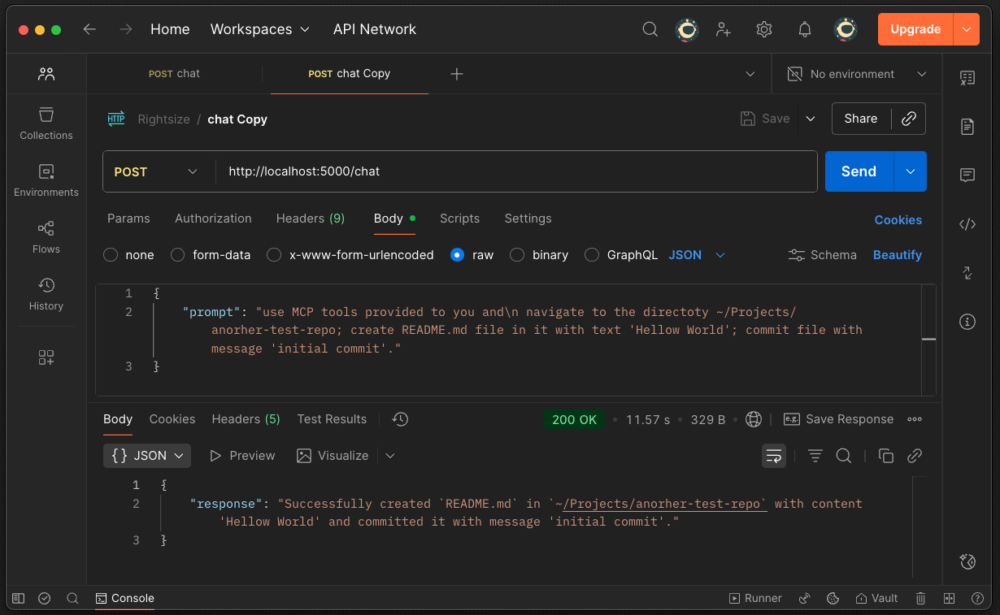
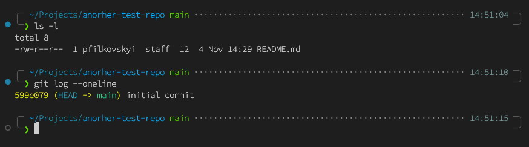

## Create File and Commit:

**Request**: http://localhost:5000/chat
```json
{
    "prompt": "use MCP tools provided to you and\n navigate to the directoty ~/Projects/anorher-test-repo; create README.md file in it with text 'Hellow World'; commit file with message 'initial commit'."
}
```

you can use curl if have no REST client installed:
```bash
curl -X POST http://localhost:5000/chat \
    -H "Content-Type: application/json" \
    -d '{"prompt":"...."}'
```

**Expected response**:
```json
{
    "response": "Successfully created `README.md` in `~/Projects/anorher-test-repo` with content 'Hellow World' and committed it with message 'initial commit'."
}
```




